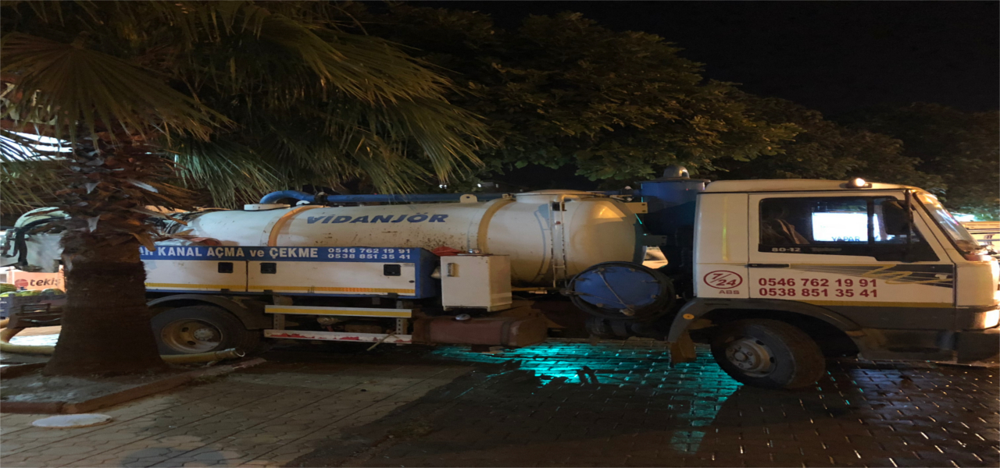
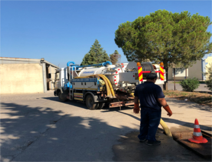
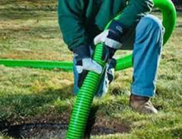

---
# Feel free to add content and custom Front Matter to this file.
# To modify the layout, see https://jekyllrb.com/docs/themes/#overriding-theme-defaults

layout: default
title: Kahramanmaraş - Sarılar Vidanjör
---

  <section class="banner-section hidden-xs">
    

      <!-- Indicators -->
      <ol class="carousel-indicators">
        <li data-target="#carousel-example-generic" data-slide-to="0" class="active"></li>
        <li data-target="#carousel-example-generic" data-slide-to="1"></li>
        <li data-target="#carousel-example-generic" data-slide-to="2"></li>
      </ol>

      <!-- Wrapper for slides -->
      

        

          
        

        

          
        

        

          
        

      

    

  </section>
  <!-- .banner-section-->

  

    

      

        <!-- Nav tabs -->
        <ul class="tablist" role="tablist" style="display: flex; justify-content: space-around;">
          <li role="presentation" class="active">
            <a href="#residential" style="font-size: 30px; padding-bottom: 15px" aria-controls="residential" role="tab"
              data-toggle="tab">Hİzmetlerİmİz</a>
          </li>
        </ul>
      

      

        

          

            

              

                
              

              

                <h3 style="margin-top:2px;">Tuvalet Tıkanıklığı Açma</h3>
                

                  Tuvaletler birçok nedenle: tuvalet kağı, kağıt havlu, ıslak mendil, ...
                

                <a href="tuvalet_tikanikligi_acma.html">Devamını Oku</a>
              

            

          

          

            

              

                
              

              

                <h3 style="margin-top:2px;">Banyo Tıkanıklığı Açma</h3>
                

                  Banyolar birçok nedenle: tuvalet kağıdı, kağıt havlu, ıslak mendil, ...
                

                <a href="banyo_tikanikligi_acma.html">Devamını Oku</a>
              

            

          

          

            

              

                
              

              

                <h3 style="margin-top:2px;">Lavabo Tıkanıklığı Açma</h3>
                

                  Lavabolar: yemek artıkları, peçte, kağıt havlu, evsel atık yağlar ...
                

                <a href="lavabo_tikanikligi_acma.html">Devamını Oku</a>
              

            

          

          

            

              

                
              

              

                <h3 style="margin-top:2px;">Rögar Tıkanıklığı Açma</h3>
                

                  Rögarlar kullanıma bağlı olarak, içerisi; kağıt havlu, ıslak mendil, tuvalet kağıdı, ...
                

                <a href="rogar_tikanikligi_acma.html">Devamını Oku</a>
              

            

          

          

            

              

                
              

              

                <h3 style="margin-top:2px;">Rögar Bakımı</h3>
                

                  Rögarlar kullanıma bağlı olarak, içerisi; kağıt havlu, ıslak mendil, tuvalet kağıdı, ...
                

                <a href="tikaniklik_acma.html">Devamını Oku</a>
              

            

          

          

            

              

                
              

              

                <h3 style="margin-top:2px;">Kanal Temİzleme ve Açma</h3>
                

                  Pis ve atık suların özel kanallar aracılığıyla belli merkezlerde toplanıp ...
                

                <a href="kanal_temizleme_ve_acma.html">Devamını Oku</a>
              

            

          

          

            

              

                
              

              

                <h3 style="margin-top:2px;">Tuvalet Kuyusu Çekİmİ ve Temİzlİğİ</h3>
                

                  Genellikle alt yapısı olmayan bölgelerde pis su ve lağımın birikmesi için ...
                

                <a href="tuvalet_kuyusu_cekimi_ve_temizligi.html">Devamını Oku</a>
              

            

          

          

            

              

                
              

              

                <h3 style="margin-top:2px;">Atık Arıtma Tesİsİ Temİzlİğİ</h3>
                

                  Fabrika vb. yerlerin bünyesinde bulunan atık arıtma tesislerinin içerisinde ...
                

                <a href="atik_aritma_tesisi_temizligi.html">Devamını Oku</a>
              

            

          

          

            

              

                
              

              

                <h3 style="margin-top:2px;">Yağmur ve Sel Suyu Tahlİyesİ</h3>
                

                  Firmamız tecrübeli personeli tarafından uygun ekipman ve cihazlar kullanılarak, ...
                

                <a href="yagmur_ve_sel_suyu_tahliyesi.html">Devamını Oku</a>
              

            

          

          

            

              

                
              

              

                <h3 style="margin-top:2px;">İnşaat Suyu Tahlİyesİ</h3>
                

                  Firmamız tecrübeli personeli tarafından uygun ekipman ve cihazlar kullanılarak, ...
                

                <a href="insaat_suyu_tahliyesi.html">Devamını Oku</a>
              

            

          

          

            

              

                
              

              

                <h3 style="margin-top:2px;">Bakterİ Naklİyesİ</h3>
                

                  Firmamız bünyesinde bulunan uygun cihaz ve ekipman kullanılarak tecrübeli ...
                

                <a href="bakteri_nakliyesi.html">Devamını Oku</a>
              

            

          

          

            

              

                
              

              

                <h3 style="margin-top:2px;">Dİğer Hİzmetler</h3>
                

                  Diğer hizmetler hakkında bilgi almak için tıklayınız.
                

                <a href="diger_hizmetler.html">Devamını Oku</a>
              

            

          

        

      

    

    <!-- .service-section-->
  

  <!-- .row-->

