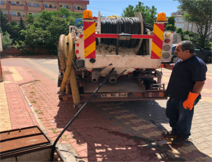

**Kanalizasyon:** Pis ve atık suların özel kanallar aracılığıyla belli merkezlerde toplanıp atılmasını sağlayan sistem, lağım döşemi, şebekedir.

Kanalizasyon kanalları birçok farklı sebepten dolayı tıkanmaktadır. Kahramanmaraş’ta firmamız bünyesinde bulunan uygun ekipman ve cihazlar kullanılarak tecrübeli personelimiz tarafından kanal temizleme ve kanal açma hizmeti verilmektedir.

*   VİDANJÖR
*   GİDER AÇMA
*   KANAL AÇMA
*   LOGAR AÇMA
*   MARAŞ VİDANJÖR
*   KAHRAMANMARAŞ VİDANJÖR
*   PİMAŞ AÇMA
*   TUVALET AÇMA
*   KANALİZASYON AÇMA
*   RÖGAR AÇMA
*   KANAL TEMİZLİĞİ
*   LOGAR TEMİZLİĞİ
*   SARILAR VİDANJÖR
*   KANALİZASYON FOSEPTİK

