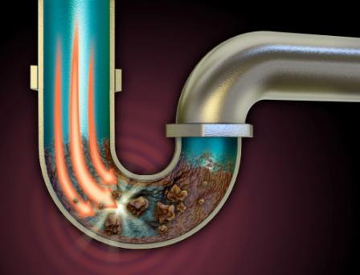

**LAVABO TIKANIKLIĞI: Mutfak lavaboları birçok nedenle tıkanabilmektedir.Lavabo tıkanıklığının başlıca sebebi, mutfak giderlerinden giden yağların donarak katı bloklar haline gelmesiyle olmaktadır.evde lavabo tıkanıklığı açma risklidir. Eğer tıkanıklık açılmazsa mutfağınız kirli su ile batabilir. Lavabo tıkanıklığını amatör olarak evde açmanız için belirli şeyler vardır. Aksi takdirde profesyonel bir yardım almanız gerekmektedir.

**EVDE LAVABO TIKANIKLIĞI AÇMA YÖNTEMİ 1:  Kaynamamış bir kova sıcak su ile(70-80 derece arası) yağ çözücü deterjanı(Bulaşık deterjanı olabilir) karıştırıp lavabonuza dökebilirsiniz.Yaklaşık 5 dk bekleyiniz. Arkasından tekrar sıcak su dökünüz. 

**LAVABO TIKANIKLIĞI AÇMA YÖNTEMİ 2 :Yarım su bardağı toz karbonat ve yarım su bardağı sirke karıştırılıp laboya döktükten sonra 10-15 dk bekleyiz ve arkasından kaynamamış su dökünüz.

**LAVABO TIKANIKLIĞI AÇMA YÖNTEMİ 3 :Sıcak su ile birlikte marketlerde bulunan lavabo açıcılar denenebilir.

**LAVABO TIKANIKLIĞI AÇMA:Eğer yukarıda bahsettiğimiz yöntemler olmuyarsa profesyonel bir yardım alınız. Lavabonuza kesinlikle asit dökmeyiniz. Asit hem giderinize hemde size zarar verebilir. Asit ile su reaksiyona girip borularınızda burulma(yamulmaya) sebebiyet verebilir. Çünkü asitle su egzotermik bir reaksiyon oluşturur ve dışarı ısı yayar. Buda borularınızda hasara sebebiyet verebilir. Ayrıca Lavabo tıkanıklığı açmak için asit dökerseniz; dökme esnasında gözlük, maske vb. koruyucu önlem almamız gerekmektedir. Eğer bu önlemler alınmaz ise sağlığınıza zarar verebilirsiniz. Kim bilir belkide döktüğünüz asit giderinizde oluşan bir kaçaktan sızıp başkasınada zarar verebilir.
 Lavabo tıkanılığı açmak için sizin yapabilecekleriniz yukarıda sıralanmıştır.

**SARILAR VİDANJÖR: Kırmadan ve dökmeden lavabo tıkanıklığı açılır.

**Peki, kırmadan ve dökmeden nasıl lavabo tıkanıklığı açılır?

**Firmamız bünyesinde tıkanıklık açmaya dair birçok alet ve cihaz bulunmaktadır. Tıkanıklık açma robotu, kombine kanal açma aracı vb.Herşeyden önemlisi 20 yılı aşkın lavabo açma tecrübemiz bulunmkatadır.

**Kahramanmaraş’ta firmamız bünyesinde bulunan uygun ekipman ve cihazlar kullanılarak	tecrübeli personelimiz tarafından kırmadan ve dökmeden lavabo tıkanıklığı/ tıkanıklık açılır.

*   TIKANIKLIK AÇMA
*   VİDANJÖR
*   GİDER AÇMA
*   KAHRAMANMARAŞ TIKANIKLIK AÇMA
*   MARAŞ TIKANIKLIK AÇMA
*   ONİKİŞUBAT TIKANIKLIK AÇMA
*   DULKADİROĞLU TIKANIKLIK AÇMA
*   TÜRKOĞLU TIKANIKLIK AÇMA
*   KAHRAMANMARAŞ LAVABO TIKANIKLIĞI AÇMA
*   ONİKİŞUBAT LAVABO TIKANIKLIĞI AÇMA
*   DULKADİROĞLU LAVABO TIKANIKLIĞI AÇMA
*   TÜRKOĞLU LAVABO TIKANIKLIĞI AÇMA
*   KAHRAMANMARAŞ TUVALET TIKANIKLIĞI AÇMA
*   ONİKİŞUBAT TUVALET TIKANIKLIĞI AÇMA
*   DULKADİROĞLU TUVALET TIKANIKLIĞI AÇMA
*   TÜRKOĞLU TUVALET TIKANIKLIĞI AÇMA
*   MARAŞ VİDANJÖR
*   KAHRAMANMARAŞ VİDANJÖR
*   PİMAŞ AÇMA
*   TUVALET AÇMA
*   KANALİZASYON AÇMA
*   RÖGAR AÇMA
*   KANAL TEMİZLİĞİ
*   LOGAR TEMİZLİĞİ
*   SARILAR VİDANJÖR
*   KANALİZASYON FOSEPTİK

